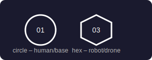
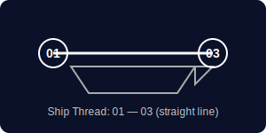
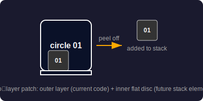

  

# IPIS / Duranki – InterPlanetary Identity System

**IPIS (InterPlanetary Identity System)** — a protocol for identifying objects in the Solar System (and beyond).

> **An architectural proposal for a future civilisation colonising worlds.**  
> Codename: **“Duranki”** (Sumerian for “The Bond of Heaven and Earth”).

IPIS gives every object (human, spacecraft, planet, satellite) a **human‑readable code** and an **accumulated travel history** – the **Experience Stack**.

The system does not replace national flags or existing systems (NORAD, transponders). It works alongside them, creating a common semantic layer for space activities.

---

## What problem does it solve?

The lack of a universal, instantly readable, Earth‑independent way to identify the origin, qualifications, and route of a person or object in the context of a distributed human presence in the Solar System and beyond.

It replaces cumbersome Earth‑bound bureaucratic procedures and digital databases with a single visual‑electronic language that is understandable to both humans and computers anywhere in space.

---

## Key Features

**Core of the system** – symbolic‑geometric notation and a digital code for an object according to the space expansion plan.

**Geometry:**

- Circle — life: human, base, crewed spacecraft
- Hexagon — robot, drone, uncrewed vehicle

**Symbols:**

- `01` — Earth
- `02` — Moon
- `03` — Mars
- Further worlds: `04`, `05`…
- Apostrophe (`'`) — orbital object (station, satellite)
- `E` — extravehicular activity (high‑risk status)
- `00` — deep space beyond Mars orbit

  

**Visual representation:**
- **Primary marking** – circle (human/base) or hexagon (robot), planet numbers and indices. On a person it takes the form of a patch: a large circle with the symbol inside.
- **Experience Stack (Snezhkov Stack)** – a symbolic sequence of status changes during travel. In an electronic log, the object’s stack accumulates. On a person it is shown on the patch: a row of touching discs under the main patch (the large digit indicates the current location / base). The first disc is the birthplace, then long‑term work locations and spacewalks.  
  

- **Ship Thread** – route diagram. A straight line on the hull from the start node to the end node (e.g. `01—03`). Intermediate manoeuvres are digital only.  
  

---

## Star Prefix (for the very distant future, sci‑fi and games)

- `SUN` — Sun
- `PRX` — Proxima Centauri
- … and so on

---

## Quick Example of a Patch

A person born on Earth (`01`), who worked on a lunar orbital station with spacewalks (`02’E`), and is currently on Mars (`03`):

- **Main patch:** circle with `03`
- **Stack:** `01` `02’` `E`
- **Two‑layer mechanism:** when leaving the lunar station, the outer `02’` layer was peeled off, and the inner disc `02’` (plus the `E` disc earned there) became part of the stack.

---

## Repository Structure

- `presentation/` – slides (Markdown source, and eventually PDF)
- `docs/` – full specifications, stack guide, RFID spec, NORAD extension, logbook‑based verification, cultural examples, quick start guide
- `assets/` – SVG logo, patch designs, stack layout, ship thread, two‑layer diagram, basic symbols
- `LICENSE` – CC BY-SA 4.0
- `CONTRIBUTING.md` – how to help
- `CODE_OF_CONDUCT.md` – community guidelines

---

## How to Use

1. **Quick start** – [Quick Start Guide](docs/quickstart.md) – make your first IPIS patch in 5 minutes.
2. **Learn stack mechanics** – [Stack Guide](docs/stack_guide.md) – detailed patch donning / updating.
3. **Dive into technical integration** – [RFID spec](docs/rfid_spec.md) and [NORAD extension](docs/norad_extension.md).
4. **Explore cultural examples** – [Stack Examples](docs/stack_examples.md) 
5. **Glossary** [Glossary](docs/glossary.en.md)

The system is **open** – you can adopt, adapt, and pilot it. Feedback and contributions are welcome.

---

## Additional Elements

- **Two‑layer patch** – the outer layer of the large circle patch shows the current code; under it hides a flat disc (future stack element). When you leave a base, the outer layer is peeled off and the inner disc is added to your stack. No need to print new badges in space.  
  

- **Rituals:** “Base Gulp” – a fictional tradition that solidifies the code change (initiation). The newcomer receives a vessel of local water, takes a sip (symbolic acceptance into the ecosystem), and the senior hands over the new patch, tearing off the old one with a Velcro sound. This does not replace official procedures – it is a human anchor, a symbol of belonging. Isolated crews need rituals no less than they need instructions.
- **Technical integration** – RFID chips in patches for access control; `IPIS_CODE` field in NORAD / Space‑Track.org. Stack verification is based on digitally signed ship/base logbooks.
- **Colour palette** – black‑and‑white, high contrast.

---

## Contributing

We welcome contributions of all kinds: bug reports, design improvements, code, translations, and community building.  
Please read [CONTRIBUTING.md](CONTRIBUTING.md) and our [Code of Conduct](CODE_OF_CONDUCT.md) before submitting anything.

**Ways to help**:
- Create mods for space games: Kerbal Space Program, Star Citizen, Elite Dangerous, and others.
- Translate documentation into other languages.
- Improve SVG assets or add new examples.
- Write a script to convert NORAD IDs to `IPIS_CODE`.
- **Spread the word – articles, videos, social media.**

---

> *“There’s a starman waiting in the sky…”* – David Bowie, *Starman* (1972)

## Author

**Dmitry Snezhkov**, 01 — EARTH; version 1.0, April 2026
