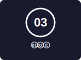

  
   
  <em>Дуранки – Нить Неба и Земли</em>

# IPIS / Дуранки – Межпланетная система идентификации

> *«Там, в небе, нас ждёт звёздный человек…»* – Дэвид Боуи, «Starman» (1972)

**IPIS (InterPlanetary Identity System)** — добровольный протокол идентификации, контроля доступа и навигации в Солнечной системе. Кодовое имя — **«Дуранки»** (шумерское «Нить Неба и Земли»).

> **IPIS — это не просто дизайн-система, это социо-техническая операционная система.**  
> Ракеты — это железо. IPIS — это софт, который позволяет разным людям, странам и машинам работать вместе без конфликтов.

  

IPIS даёт каждому объекту (человеку, кораблю, роботу) **человеко-читаемый код** и **накапливаемую историю миров** — **Стек Снежкова**.

Система не отменяет национальные флаги и существующие системы (NORAD, транспондеры). Она работает рядом с ними, создавая общий семантический слой для космической деятельности.

---

## Ключевые особенности

- **Простое кодирование** – круг (человек/база), шестиугольник (робот), номера 01 (Земля), 02 (Луна), 03 (Марс), индексы `'` (орбита), `E` (выход в космос), `00` (глубокий космос).  
- **Стек Снежкова** – горизонтальный ряд соприкасающихся кружков, каждый с номером мира. Первый кружок – место рождения, затем места работы (>6 месяцев). Кружок `E` добавляется после мира, где были выходы в открытый космос.  
- **Нить корабля** – прямая линия на корпусе от начального узла к конечному (например, `01—03`). Промежуточные манёвры – только в цифровом профиле.  
- **Двухслойный шеврон** – внешний слой показывает текущий код; под ним скрыта плоская плашка (будущий элемент стека). При убытии с базы внешний слой отлепляется, а внутренняя плашка добавляется в стек. Не нужно печатать новые плашки в космосе.  
- **Ритуал «Глоток базы»** – стакан местной воды, глоток, звук липучки – символическое принятие в экосистему.  
- **Техническая интеграция** – RFID-чипы в шевронах для контроля доступа; поле `IPIS_CODE` в каталоге NORAD / Space‑Track.org. Верификация стека – по цифровым подписям в бортовых журналах.  

  
  

---

## Быстрый пример

Человек, родившийся на Земле (`01`), работавший на лунной орбитальной станции с выходами в космос (`02’E`) и находящийся сейчас на Марсе (`03`):

- **Основной шеврон:** круг с `03`  
- **Стек:** `01` `02’` `E`  
- **Двухслойный механизм:** при убытии с лунной станции внешний слой `02’` был отлеплен, а внутренняя плашка `02’` (и кружок `E`, заработанный там) стали частью стека.

---

## Структура репозитория

- `presentation/` – слайды (исходник Markdown и, в перспективе, PDF)  
- `docs/` – полные спецификации, руководство по стеку, описание RFID, расширение NORAD, верификация через журналы, примеры из культуры, быстрое начало  
- `assets/` – SVG-логотип, дизайны шевронов, схема стека, нить корабля, схема двухслойного шеврона, основные символы  
- `LICENSE` – лицензия CC BY-SA 4.0  
- `CONTRIBUTING.md` – как помочь проекту  
- `CODE_OF_CONDUCT.md` – правила сообщества  

---

## Как использовать

1. **Быстрый старт** – [Руководство для начинающих](docs/quickstart.md) – сделайте свой первый шеврон IPIS за 5 минут.  
2. **Изучите презентацию** – [Слайды](presentation/slides.md) (можно конвертировать в PDF).  
3. **Узнайте механику стека** – [Руководство по стеку](docs/stack_guide.md) – подробно о надевании и обновлении шеврона.  
4. **Погрузитесь в техническую интеграцию** – [Спецификация RFID](docs/rfid_spec.md) и [Расширение NORAD](docs/norad_extension.md).  
5. **Посмотрите культурные примеры** – [Примеры стека](docs/stack_examples.md) (майор Том, Джон Картер и др.).  

Система **открыта** – вы можете принимать её, адаптировать и проводить пилотные проекты. Приветствуются отзывы и вклад.

---

## Участие в проекте

Мы приветствуем любые виды вклада: сообщения об ошибках, улучшения дизайна, код, переводы, развитие сообщества.  
Пожалуйста, прочитайте [CONTRIBUTING.md](CONTRIBUTING.md) и наш [Кодекс поведения](CODE_OF_CONDUCT.md) перед отправкой изменений.

**Чем можно помочь**:
- Создать мод для Kerbal Space Program, Star Citizen или Elite Dangerous.  
- Перевести документацию на другие языки.  
- Улучшить SVG-активы или добавить новые примеры.  
- Написать скрипт для преобразования NORAD ID в `IPIS_CODE`.  
- Рассказывать о проекте – статьи, видео, социальные сети.

---

## Автор

**Снежков Д.**, 01 — ЗЕМЛЯ  
Кодовое имя: **«Дуранки»** (Duranki – Нить Неба и Земли)  
Версия 15.0, апрель 2026 г.

*«Мы строим не стену, а мост.»*
